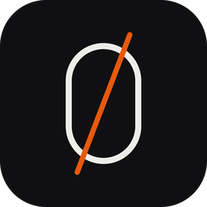

  

<h1 align="center">Draft Zero</h1>

<strong>Build with every agent. Stay in command.</strong>

  The official release channel for the Draft Zero desktop workspace. 
  <a href="https://draftzero.dev">Website</a> ·
  <a href="https://github.com/draftzerodev/releases/releases">Releases</a> ·
  <a href="https://draftzero.dev/privacy">Privacy</a>

---

## Release status

> [!NOTE]
> Draft Zero is currently in private alpha. Approved builds are available only
> to invited testers.

| | Platform | Release line | Availability |
| :--: | --- | :--: | --- |
|  | **macOS** | `0.x alpha` | **Private alpha** · Universal DMG · macOS 15+ · Apple silicon and Intel |
| ⊞ | **Windows** | `0.x alpha` | **Planned** |
| 🐧 | **Linux** | `0.x alpha` | **Planned** |

Alpha builds use Semantic Versioning identifiers such as
`0.1.0-alpha.1`. The first stable public release will be `1.0.0`.

## Downloads

Approved builds are published on the
[Releases page](https://github.com/draftzerodev/releases/releases) with release
notes and signed installation media. The permanent download and update-feed
host is [releases.draftzero.dev](https://releases.draftzero.dev).

The application source is maintained separately from this public distribution
repository.

## Release integrity

Published macOS builds are:

- signed with an Apple Developer ID certificate;
- notarized by Apple and distributed as a universal DMG; and
- delivered through a cryptographically signed in-app update feed.

Download Draft Zero only from this repository or from a link on
[draftzero.dev](https://draftzero.dev).

---

© 2026 Draft Zero

